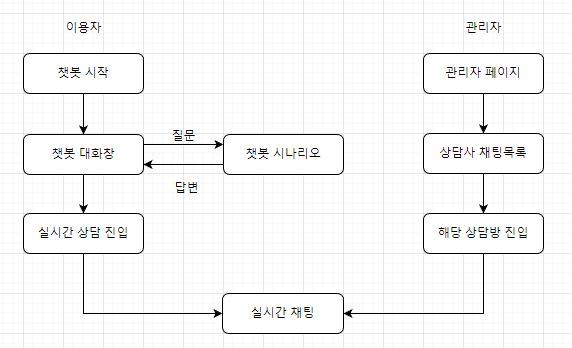
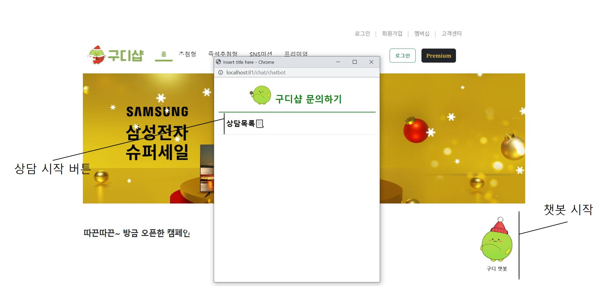
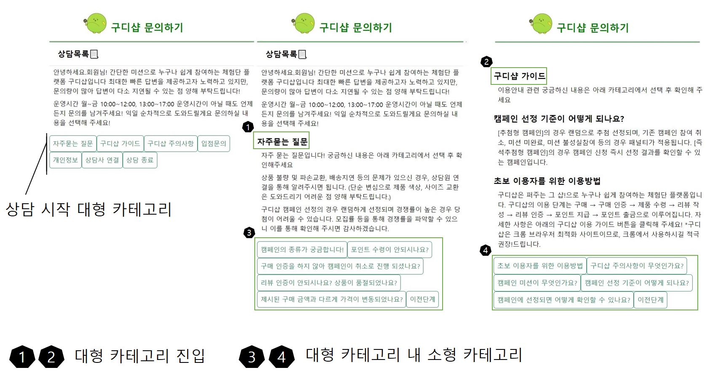
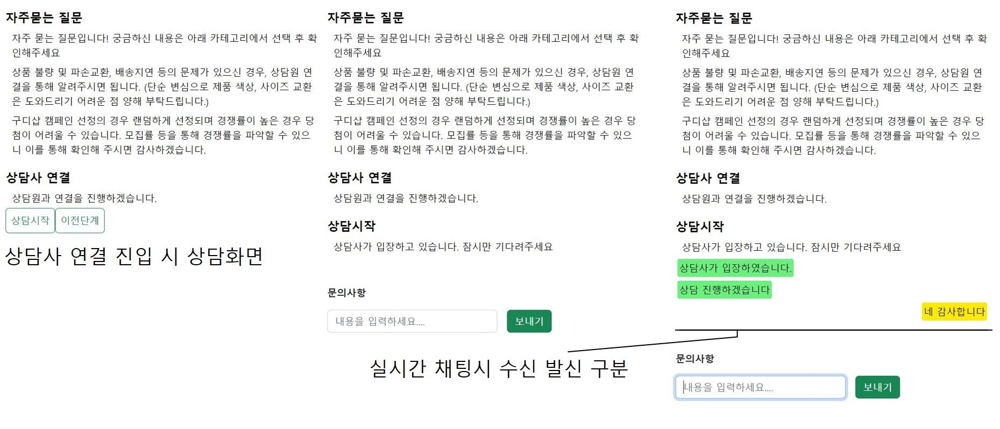
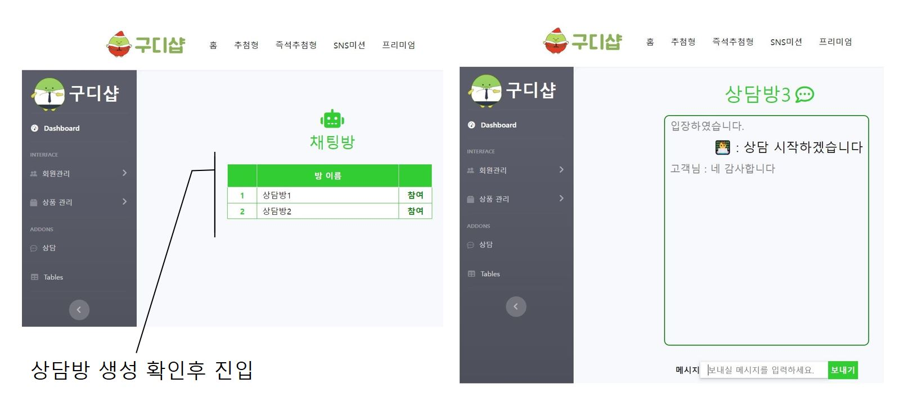

# PORTFOLIO

## 📗 목차


- [개요](#포트폴리오-개요)
- [설계](#설계/개발)
- [기능 구현](#기능-구현)
- [고려 사항](#고려-사항)
- [프로젝트 후기](#프로젝트-후기)

## **포트폴리오 개요**

> **프로젝트:** 리뷰 체험단 플랫폼[모티브 - 퍼그샵]
>
> **분류:** 팀 프로젝트[5명]
>
> **제작 기간:** 2022.11 ~ 2022.12
>
> **개발 목표** 
>
> 웹 쇼핑몰 에서 물건을 구매할 때 리뷰 인증 등 미션을 통해 포인트를 받아 환금이 가능하여 저렴하게 구매 가능한 **웹 사이트** 
> 판매자는 사이트 측에 홍보 금액을 지불하여 물품의 판매율 및 홍보가 가능
> 구매자는 사이트 측에서 미션을 수행하여 저렴한 금액에 구매 가능
> 
> 개인으로서는 최근 웹 사이트에서 챗봇을 매우 흔하게 볼 수 있는만큼 제대로 공부하여 개발하기 위해
> 챗봇이 가지는 기능들을 최대한 구현했다.
>
> **담당 기능:** 상담 챗봇, 실시간 채팅 및 상담, 상담방 관리
>
> **사용 기술 및 도구** 
> 
> 기반  :   
> 
> 프론트 :    
>
> 백     :  (*Java 11) 
>
>추가 API : spring security oauth2, CLOVA chatbot (Naver)

## **설계/개발**
- #### 기능 구조

* Non DB

## **기능 구현**

#### 화면 구현



- 스크롤 상관없이 우측하단에 버튼 유지


#### 챗봇 상담



- 대형 카테고리 6가지, 소형 카테고리 18개, 웰컴 메세지, 종료 메세지 
- 총 시나리오 26개 (엔티티 X)


#### 상담사와 실시간 상담



- 해당 페이지에서 바로 채팅 시작
- 상담사와 내담자 메세지 구분

#### 관리자 페이지 상담 목록



- 관리자 페이지에서 상담방 확인가능
- 상담방 역시 메세지 구분


## **고려 사항**
* spring security를 이용하는 경우 소켓 접속방식 고려
(관리자 페이지 역시 시큐리티 권한을 통해 접속가능)
* 챗봇의 데이터 전달 방식
(해당 프로젝트의 CLOVA 챗봇은 JSON형태의 데이터로 전송)

[소스코드 JAVA](https://github.com/Gobu1/GDShop/blob/Gobu1-readme/src/main/java/com/shop/goodee/chat/MainController.java)

[소스코드 JS](https://github.com/Gobu1/GDShop/blob/Gobu1-readme/src/main/resources/static/js/chat/app.js)

[참고 API 문서](https://api.ncloud-docs.com/docs/ai-application-service-chatbot-chatbot#api-%EC%98%88%EC%A0%9C)

<details markdown="1">
    <summary> 챗봇 데이터 처리과정 </summary>
<div markdown="1">
챗봇 데이터 수신 발신 처리 JAVA

``` Java
//
@RequestMapping("/sendMessage")
@ResponseBody
public String sendMessage(@RequestBody String chatMessage) throws IOException {

    URL url = new URL(apiUrl);
    String message =  getReqMessage(chatMessage);
    String encodeBase64String = makeSignature(message,secretKey);

    //api서버 접속 (서버 -> 서버 통신)		
    HttpURLConnection con = (HttpURLConnection)url.openConnection();
    con.setRequestMethod("POST");
    con.setRequestProperty("Content-Type", "application/json;UTF-8");
    con.setRequestProperty("X-NCP-CHATBOT_SIGNATURE", encodeBase64String);
    con.setDoOutput(true);
    DataOutputStream wr = new DataOutputStream(con.getOutputStream());
        
    wr.write(message.getBytes("UTF-8"));
    wr.flush();
    wr.close();
    int responseCode = con.getResponseCode();
    BufferedReader br;

    if(responseCode==200) { // 정상 호출
        BufferedReader in = new BufferedReader(
            new InputStreamReader(con.getInputStream(), "UTF-8"));
        String decodedString;
        String jsonString  = "";
        while ((decodedString = in.readLine()) != null) {
            jsonString = decodedString;
        }
            
        //받아온 값을 세팅하는 부분
        JSONParser jsonparser = new JSONParser();
        try {
            JSONObject json = (JSONObject)jsonparser.parse(jsonString);
            JSONArray bubblesArray = (JSONArray)json.get("bubbles");
            chatMessage = "";
            log.info("Response JSON => {}", bubblesArray);
            for(int i=0; i<bubblesArray.size(); i++) {
                JSONObject bubbles = (JSONObject)bubblesArray.get(i);
                JSONObject data = (JSONObject)bubbles.get("data");
                String description = "";
                description = (String)data.get("description");
                chatMessage = chatMessage + "|" + description;
            }
        } 
        catch (Exception e) {
            e.printStackTrace();
        }
    in.close();
    }
    else {  // 에러 발생
        chatMessage = con.getResponseMessage();
    }
    return chatMessage;
}

```
데이터 수신 발신 Ajax
```javascript
function commonAjax(url, parameter, type, calbak, contentType) {
    $.ajax({
        url: '/chat' + url,
        data: JSON.stringify(parameter),
        type: type,
        contentType: contentType != null ? contentType : 'application/json; charset=UTF-8',
        success: function (res) {
            calbak(res);
        },
        error: function (err) {
            console.log('error');
            calbak(err);
        }
    });
}
//수신 메세지 처리
function ajaxMessage(message) {
    const messages = message.split(['|']);
    for (let i = 1; i < messages.length; i++) {
        ((x) => {
            setTimeout(() => {
                showMessageRecive(messages[i]); //서버에 메시지 전달 후 리턴받는 메시지
            }, 300 * x);
        })(i);
    }
}

```

</div>

</details>

<details markdown="1">
    <summary> JSON 데이터 예시 </summary>

<div markdown="1">

```

챗봇 메세지 수신 발신시 데이터 예시
발신 시 JSON
{"bubbles":
	[{"data":{"description":"\"자주묻는 질문\""},"type":"text"}],
	"event":"send","version":"v2",
	"userId":"7f2eaf6f-9d7d-4df8-9992-7d9927e6800b",
	"timestamp":1675065382369}

*수신 시 JSON
[{"data":
	{"description":"자주 묻는 질문입니다! 궁금하신 내용은 아래 카테고리에서 선택 후 확인해주세요"},
	"context":[],
	"information":[{"value":"TEXT","key":"chatType"},
	{"value":"TEXT,TEXT,TEXT","key":"chatType"},
	{"value":"entity=자주묻는=자주묻는 질문","key":"tagInfo"},
	{"value":"1.0","key":"score"},
	{"value":"QNA","key":"scenarioName"},
	{"value":"QNA","key":"conversationTypes"},
	{"value":"exactMatch","key":"matchingType"},
	{"value":"SHChat","key":"domainCode"}],
	"type":"text"},
  {"data":
	{"description":"상품 불량 및 파손교환, 배송지연 등의 문제가 있으신 경우, 상담원 연결을 통해 알려주시면 됩니다. (단순 변심으로 제품 색상, 사이즈 교환은 도와드리기 어려운 점 양해 부탁드립니다.)"},
	"information":[{"value":"TEXT","key":"chatType"},
	{"value":"TEXT,TEXT,TEXT","key":"chatType"},
	{"value":"entity=자주묻는=자주묻는 질문","key":"tagInfo"},
	{"value":"1.0","key":"score"},
	{"value":"SHChat","key":"domainCode"}],
	"type":"text"},
  {"data":
	{"description":"구디샵 캠페인 선정의 경우 랜덤하게 선정되며 경쟁률이 높은 경우 당첨이 어려울 수 있습니다. 모집률 등을 통해 경쟁률을 파악할 수 있으니 이를 통해 확인해 주시면 감사하겠습니다."},
	"information":
	[{"value":"TEXT","key":"chatType"},
	{"value":"TEXT,TEXT,TEXT","key":"chatType"},
	{"value":"entity=자주묻는=자주묻는 질문","key":"tagInfo"},
	{"value":"1.0","key":"score"},
	{"value":"endOfBubble","key":"endOfBubble"},
	{"value":"SHChat","key":"domainCode"}],
	"type":"text"}]

```

</div>

</details>

## **프로젝트 후기**
초기에는 STOMP를 사용하여 챗봇과 통신을 진행하려 하였지만 security에 막히고 JWT 토큰 역시 기존 채팅 웹소켓과 겹칠 수 있어 AJAX를 통해 해결했다. 
챗봇을 모바일이 아닌 웹 커스텀에 적용시켜 사용해본것은 처음이라 생각보다 세세하게 신경써야 했다. 챗봇에서 바로 웹소캣 채팅으로 연결할 수 있는 기능을 만드는데 너무 신경을 쏟아 마무리가 다소 아쉬웠다. 시간이 더 있었다면 모달 형태로 적용시켜 보는것도 생각해봐야겠다.
다만 JSON의 데이터를 원하는 형태로 추출하고 원하는 결과물 자체는 낼 수 있어 매우 공부가 되었다.
